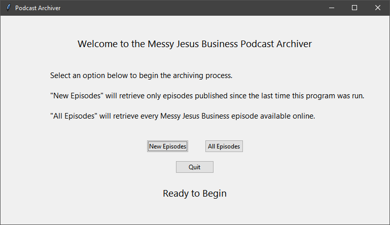
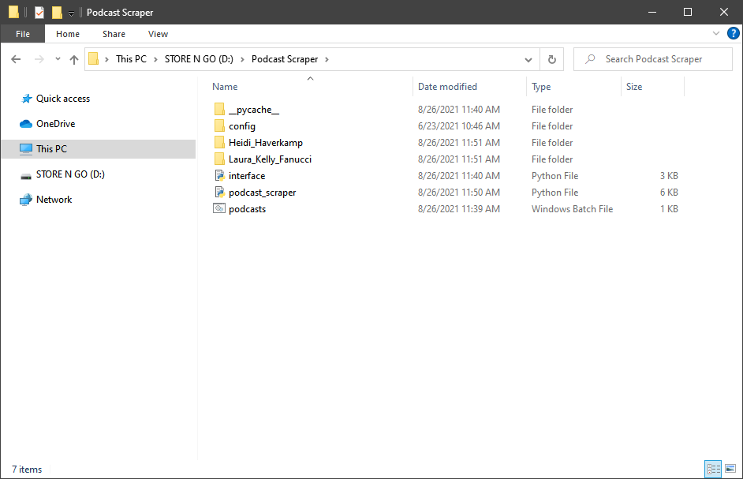
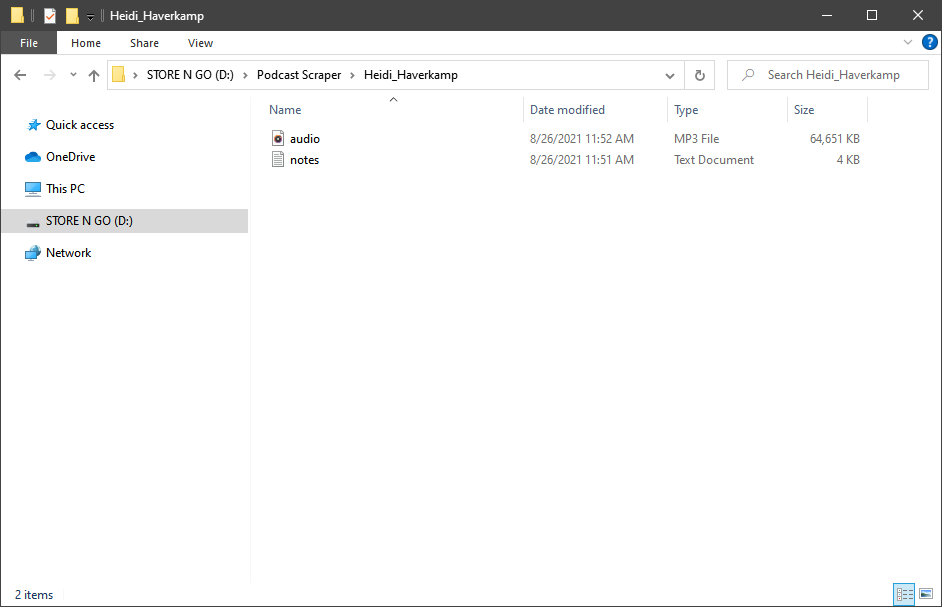

# Podcast Archiver

## Installation

### Installing Python
To set this program up, you must first download Python and install the Python interpreter. This can be found at either:

 - [The Official Python Website](https://www.python.org/downloads/)
 - [Using the Windows store](https://www.microsoft.com/en-us/p/python-39/9p7qfqmjrfp7)

Whichever option you choose, follow the on-screen instructions to install Python to your computer. For more specific
directions, please consult the "Installing Python" section of this
[Microsoft Docs Page](https://docs.microsoft.com/en-us/windows/python/beginners#install-python).
 
### Setting up the Program
Once Python is installed, download the code from the Releases tab, or by following
[this download link](https://github.com/Isaac-Newt/podcast-archiver/archive/refs/tags/v1.0.zip). Save the .zip file,
and extract it in your file manager. 

## Using the Podcast Archiver

### Running the program

#### Windows
To run this program, simply double-click the "podcasts.bat" file in your file manager. This will launch a black command prompt
window, as well as the program window. On first run, you will see loading text in the command prompt window as the script
installs the necessary Python packages.

#### MacOS and Linux
To run this program, mark the shell script provided as executable, and run in a terminal with `./podcasts.sh` Alternatively,
if you have the required Python packages installed (see [Requirements](#requirements)), you can run the program with `python3 interface.py`

### Program usage
In the program window, select the operation you wish to perform - either downloading all podcast episodes, or only those
published since the program was previously used.

For each podcast episode downloaded, a folder will be created in the same folder from which the program is run. This folder
will contain an mp3 audio file (the podcast itself) as well as a plaintext file containing the podcast "show notes" as they
appear on the webpage.

## Requirements

This program relies on the following Python packages:
 - [BeautifulSoup 4](https://www.crummy.com/software/BeautifulSoup/)
 - [Requests](https://docs.python-requests.org/en/master/)
 - [SoupSieve](https://facelessuser.github.io/soupsieve/)

For easy setup, use `python3 -m pip install -r config/requirements.txt` to install the necessary packages.

## License

This program is licensed under the [MIT Open-Source License](https://mit-license.org/), a copy of which is available with
the code, as well as at the link provided. For a quick explanation of the terms, you can reference 
[choosealicense.com](https://choosealicense.com/licenses/mit/).
